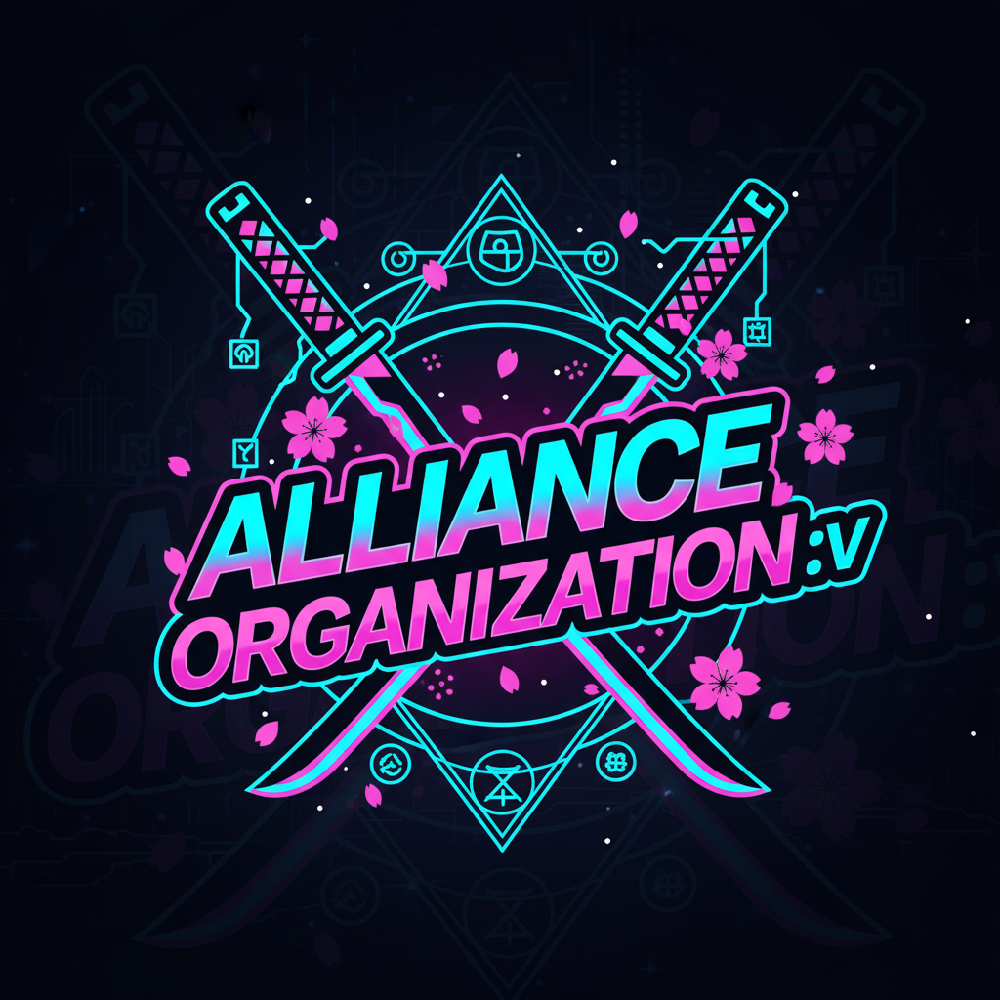

<div align="center">
  <a href="https://github.com/Ocennami/alliance-website">
    
  </a>
  <h1 align="center">Alliance Organization ":v" Website</h1>
  <p align="center">
    A modern, feature-rich web application for the Alliance Organization ":v".
    <br />
    <a href="https://github.com/Ocennami/alliance-website/issues">Report Bug</a>
    ·
    <a href="https://github.com/Ocennami/alliance-website/issues">Request Feature</a>
  </p>
</div>

<div align="center">

[](https://opensource.org/licenses/MIT)
[](https://nextjs.org/)
[](https://react.dev/)
[](https://www.typescriptlang.org/)
[](https://supabase.io/)
[](https://tailwindcss.com/)
[](https://www.framer.com/motion/)

</div>

---

## 🌟 About The Project

Welcome to the official repository for **Alliance Organization ":v" website** - a Minecraft community that has been thriving since 2020! 🎮

This is a modern, feature-rich web application built with cutting-edge technologies to showcase our 5-year journey, 10+ dedicated members, and memorable events. The website provides a seamless and engaging user experience with secure authentication, dynamic profile management, custom HTML/CSS/JS profiles, and real-time communication.

**Our Story**: From playing on the famous aemine.vn server to creating our own private servers and hosting exclusive events, Alliance Organization ":v" has grown into a tight-knit family connected through screens and bonded through Minecraft. 🌍

## ✨ Features

### 🔐 **Authentication & Security**

- ✅ Secure user login and registration using **NextAuth.js**
- ✅ Server-side credential validation (no exposed secrets)
- ✅ Session management with NextAuth
- ✅ Protected routes and API endpoints

### 👤 **Profile Management**

- ✅ Customizable user profiles with avatar upload
- ✅ Advanced **avatar cropping** with react-easy-crop
- ✅ Real-time profile updates
- ✅ **Custom HTML/CSS/JS profiles** - Create your own unique profile page!
- ✅ Profile preview modal before publishing
- ✅ Free-draw canvas for creative profiles

### 🎨 **Beautiful UI/UX**

- ✅ **Modern gradient designs** with Tailwind CSS 4
- ✅ Smooth **animations** powered by Framer Motion
- ✅ **Responsive design** - Perfect on mobile, tablet, and desktop
- ✅ Loading skeletons for better perceived performance
- ✅ Toast notifications for user feedback
- ✅ Error boundaries for graceful error handling

### 🌐 **Pages & Content**

- ✅ **Home Page**: Stunning video background hero section
- ✅ **About Page**: Our mission, vision, and values
- ✅ **Members Page**: Meet our community with customizable profiles
- ✅ **Gallery Page**: Timeline of events and memories (2020-2025)
- ✅ **Contact Page**: Get in touch with us

### 💬 **Communication**

- ✅ **ChitChat Widget**: Real-time communication within the site
- ✅ Seamless integration with the UI

### 🚀 **Performance & SEO**

- ✅ **Next.js 16** App Router for optimal performance
- ✅ Server-side rendering (SSR) and Static Site Generation (SSG)
- ✅ Image optimization with Next.js Image component
- ✅ **SEO optimized** with comprehensive metadata
- ✅ Open Graph and Twitter Card support
- ✅ Mobile performance optimizations (reduced animations)

### ♿ **Accessibility**

- ✅ ARIA labels for screen readers
- ✅ Keyboard navigation support
- ✅ Focus states for interactive elements
- ✅ Semantic HTML structure

### 🛠️ **Developer Experience**

- ✅ **TypeScript** for type safety
- ✅ ESLint for code quality
- ✅ Centralized constants library
- ✅ Reusable component architecture
- ✅ Well-documented codebase

## 🚀 Tech Stack

### **Core Framework**

- ⚡ **[Next.js 16.0](https://nextjs.org/)** - React framework with App Router
- ⚛️ **[React 19.2](https://react.dev/)** - Latest React with new features
- 📘 **[TypeScript 5](https://www.typescriptlang.org/)** - Type-safe development

### **Styling & Animation**

- 🎨 **[Tailwind CSS 4](https://tailwindcss.com/)** - Utility-first CSS framework
- ✨ **[Framer Motion](https://www.framer.com/motion/)** - Production-ready animations
- 🖋️ **[Geist Font](https://vercel.com/font)** - Vercel's font family

### **Backend & Database**

- 🗄️ **[Supabase](https://supabase.io/)** - Backend-as-a-Service (PostgreSQL)
- 🔐 **[NextAuth.js](https://next-auth.js.org/)** - Authentication solution
- 🌐 **API Routes** - Server-side endpoints

### **UI Components & Libraries**

- 🎭 **[Headless UI](https://headlessui.com/)** - Unstyled accessible components
- 🖼️ **[React Easy Crop](https://www.npmjs.com/package/react-easy-crop)** - Image cropping
- 🎨 **[React Icons](https://react-icons.github.io/react-icons/)** - Icon library
- 💻 **[Prism.js](https://prismjs.com/)** - Syntax highlighting
- ✍️ **[React Simple Code Editor](https://www.npmjs.com/package/react-simple-code-editor)** - Code editor component

### **Development Tools**

- 🔍 **[ESLint](https://eslint.org/)** - Code linting
- 📦 **[npm](https://www.npmjs.com/)** - Package manager
- 🔧 **[PostCSS](https://postcss.org/)** - CSS processing

## 🏁 Getting Started

Follow these instructions to get a copy of the project up and running on your local machine for development and testing purposes.

### Prerequisites

- [Node.js](https://nodejs.org/en/) (v20 or later)
- [npm](https://www.npmjs.com/)

### Installation

1.  **Clone the repository:**

    ```bash
    git clone https://github.com/Ocennami/alliance-website.git
    cd alliance-website
    ```

2.  **Install dependencies:**

    ```bash
    npm install
    ```

3.  **Set up environment variables:**

    Copy the example environment file and fill in your values:

    ```bash
    cp .env.example .env.local
    ```

    Then edit `.env.local` with your actual values. See `.env.example` for detailed comments on each variable.

    **Required variables:**

    ```env
    # Supabase (get from https://app.supabase.io -> Project Settings -> API)
    NEXT_PUBLIC_SUPABASE_URL=your_supabase_project_url
    NEXT_PUBLIC_SUPABASE_ANON_KEY=your_supabase_anon_key

    # NextAuth (generate secret: openssl rand -base64 32)
    NEXTAUTH_URL=http://localhost:3000
    NEXTAUTH_SECRET=your_nextauth_secret_key

    # Media
    NEXT_PUBLIC_VIDEO_URL=your_background_video_url

    # Optional: Special Account for Migration
    SPECIAL_ACCOUNT_EMAIL=your_special_account_email
    SPECIAL_ACCOUNT_PASSWORD=your_special_account_password
    ```

    💡 **Tip**: Check `.env.example` for a complete template with detailed explanations!

4.  **Run the development server:**

    ```bash
    npm run dev
    ```

    Open [http://localhost:3000](http://localhost:3000) with your browser to see the result.

5.  **Available Scripts:**

    ```bash
    npm run dev      # Start development server
    npm run build    # Build for production
    npm run start    # Start production server
    npm run lint     # Run ESLint
    ```

## 📖 Documentation

- **[IMPROVEMENTS.md](./IMPROVEMENTS.md)** - Detailed changelog of recent improvements (Nov 10, 2025)
- **[.env.example](./.env.example)** - Environment variables template with documentation

### 🎯 Key Features Documentation

#### Custom Profiles

Members can create fully customized profiles using HTML, CSS, and JavaScript:

1. Go to Members page
2. Edit your profile
3. Click "Code Editor" to write custom code
4. Preview and save your unique profile!

#### Avatar Cropping

Built-in avatar cropping tool:

- Upload any image
- Crop to perfect circle
- Real-time preview
- Automatic optimization

#### Toast Notifications

```typescript
import Toast from "@/components/Toast";
// Use for user feedback throughout the app
```

#### Loading States

```typescript
import { MemberCardSkeleton } from "@/components/Skeleton";
// Show during data loading
```

## 📂 Project Structure

```
alliance-website/
├── app/                          # Next.js 16 App Directory
│   ├── (auth)/                   # Authentication routes
│   │   ├── auth.css
│   │   ├── layout.tsx
│   │   └── loginpage/
│   │       └── page.tsx          # Login page with animations
│   ├── (site)/                   # Main site routes
│   │   ├── header.tsx            # Site header with navigation
│   │   ├── layout.tsx
│   │   ├── page.tsx              # Home page
│   │   ├── about/                # About Us page
│   │   ├── contact/              # Contact page
│   │   ├── gallery/              # Events gallery & timeline
│   │   └── members/              # Members showcase
│   ├── api/                      # API Routes
│   │   ├── auth/
│   │   │   ├── [...nextauth]/    # NextAuth configuration
│   │   │   └── check-special/    # 🆕 Security endpoint
│   │   └── profile/
│   │       └── update/           # Profile update endpoint
│   ├── code-editor-theme.css
│   ├── globals.css               # Global Tailwind styles
│   ├── layout.tsx                # Root layout with metadata
│   └── providers.tsx             # Context providers
│
├── components/                   # Reusable React components
│   ├── AvatarCropModal.tsx       # Avatar cropping functionality
│   ├── ChitChatWidget.tsx        # Real-time chat widget
│   ├── ErrorBoundary.tsx         # 🆕 Error handling
│   ├── FreeDrawCanvas.tsx        # Drawing canvas for profiles
│   ├── MigrateAccountModal.tsx   # Account migration
│   ├── PageTransition.tsx        # Page transition animations
│   ├── ProfileCodeEditor.tsx     # Custom HTML/CSS/JS editor
│   ├── ProfilePreviewModal.tsx   # Profile preview
│   ├── SessionProvider.tsx       # NextAuth session provider
│   ├── SettingsModal.tsx         # User settings
│   ├── Skeleton.tsx              # 🆕 Loading skeletons
│   └── Toast.tsx                 # 🆕 Notification toasts
│
├── lib/                          # Utility libraries
│   ├── constants.ts              # 🆕 App constants & messages
│   └── supabase.ts               # Supabase client
│
├── public/                       # Static assets
│   ├── events/                   # Event images
│   ├── logo/                     # Logo files
│   └── video/                    # Background videos
│
├── types/                        # TypeScript definitions
│   └── next-auth.d.ts            # NextAuth type extensions
│
├── .env.example                  # 🆕 Environment variables template
├── eslint.config.mjs             # ESLint configuration
├── IMPROVEMENTS.md               # 🆕 Changelog & improvements
├── next.config.ts                # Next.js configuration
├── package.json                  # Dependencies & scripts
├── postcss.config.mjs            # PostCSS configuration
├── README.md                     # 📖 You are here!
└── tsconfig.json                 # TypeScript configuration

🆕 = New files added in latest update (Nov 10, 2025)
```

## 🚀 Deployment

### **Recommended: Vercel** (Best for Next.js)

1. Push your code to GitHub
2. Import on [Vercel](https://vercel.com/new)
3. Add environment variables in Vercel dashboard
4. Deploy! 🎉

### **Environment Variables for Production**

Make sure to add all variables from `.env.example` to your hosting platform:

- Supabase credentials
- NextAuth configuration
- Video URLs
- Any optional variables

### **Build Command**

```bash
npm run build
```

### **Alternative Platforms**

- **Netlify**: Supports Next.js with adapter
- **Railway**: Good for full-stack apps
- **Self-hosted**: Use Docker or PM2

📚 Check [Next.js deployment docs](https://nextjs.org/docs/deployment) for more details.

## 🤝 Contributing

Contributions are what make the open source community such an amazing place to learn, inspire, and create. Any contributions you make are **greatly appreciated**! ❤️

### How to Contribute

1.  **Fork the Project**
2.  **Create your Feature Branch**
    ```bash
    git checkout -b feature/AmazingFeature
    ```
3.  **Make your changes**
    - Follow existing code style
    - Add comments for complex logic
    - Update documentation if needed
4.  **Commit your Changes**
    ```bash
    git commit -m 'Add some AmazingFeature'
    ```
5.  **Push to the Branch**
    ```bash
    git push origin feature/AmazingFeature
    ```
6.  **Open a Pull Request**

### Contribution Guidelines

- ✅ Write clear commit messages
- ✅ Follow TypeScript best practices
- ✅ Test your changes locally
- ✅ Update README if adding features
- ✅ Keep PRs focused on single features
- ✅ Be respectful and constructive

### Issues & Bugs

Found a bug? Have a feature request?

- [Report a Bug](https://github.com/Ocennami/alliance-website/issues)
- [Request a Feature](https://github.com/Ocennami/alliance-website/issues)

## 🎨 Screenshots

### Home Page

Beautiful hero section with video background and smooth animations.

### Members Page

Interactive member profiles with custom HTML/CSS/JS support and avatar customization.

### Gallery Page

Timeline of events from 2020 to 2025 with beautiful card designs.

_(Add actual screenshots to `/public/screenshots/` folder)_

---

## 📊 Project Stats

- 🎮 **Community**: 10+ active members
- 📅 **Active Since**: 2020 (5 years!)
- 🎪 **Events Hosted**: 3+ major events
- � **Tech Stack**: 10+ modern technologies
- ⭐ **Features**: 20+ unique features

---

## 🔒 Security

This project follows security best practices:

- ✅ No credentials exposed in client-side code
- ✅ Server-side API validation
- ✅ Environment variables for sensitive data
- ✅ NextAuth for secure authentication
- ✅ Supabase Row Level Security (RLS)

**Security Issues**: Please report privately to the repository owner.

---

## 🙏 Acknowledgments

- **Alliance Organization ":v" Members** - For 5 amazing years! 🎉
- **Next.js Team** - For the incredible framework
- **Vercel** - For hosting and development tools
- **Supabase** - For the awesome backend platform
- **Open Source Community** - For all the amazing libraries

---

## 📞 Contact

**Alliance Organization ":v"**

- Website: [Alliance Website](https://alliance-group-website.vercel.app)
- GitHub: [@Ocennami](https://github.com/Ocennami)
- Issues: [GitHub Issues](https://github.com/Ocennami/alliance-website/issues)

---

## �📜 License

Distributed under the **MIT License**. See `LICENSE` file for more information.

---

## 🎯 Roadmap

- [x] Core website with authentication
- [x] Member profiles with customization
- [x] Events gallery and timeline
- [x] Real-time chat widget
- [x] Mobile optimization
- [x] SEO improvements
- [x] Accessibility enhancements
- [ ] Unit & E2E tests
- [ ] PWA support
- [ ] Internationalization (i18n)
- [ ] Admin dashboard
- [ ] Enhanced analytics

---

<div align="center">

**Made with ❤️ by Alliance Organization ":v"**

_From 2020 to 2025 and beyond... 🚀_

**⭐ Star this repo if you like our project! ⭐**

</div>

---

_Last updated: November 10, 2025_
